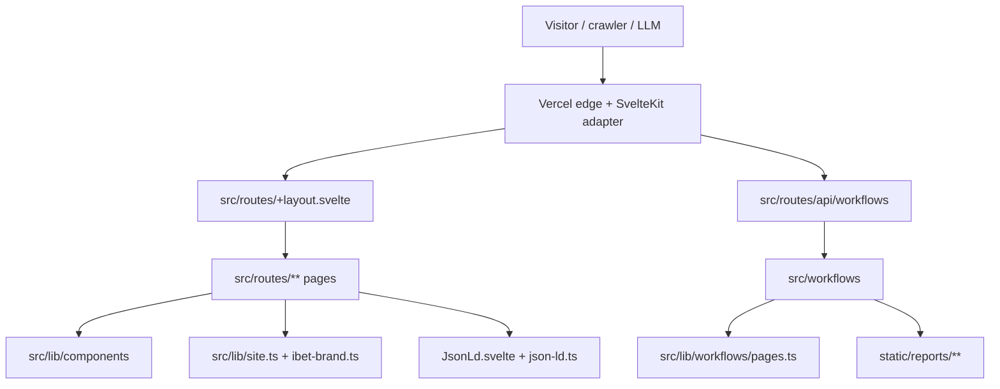

# Architecture

247iBET is a SvelteKit 2 / Svelte 5 site deployed to Vercel with Node 24 serverless functions. The product surface is an independent Canadian iGaming guide with content hubs, evergreen guides, market trackers, tools, policy pages, search, and protected operational workflow endpoints.

## High-level map

## Runtime stack

| Layer | Source | Notes |
| --- | --- | --- |
| Framework | `@sveltejs/kit`, `svelte` | SvelteKit 2 with Svelte 5 component syntax and runes where needed. |
| Styling | Tailwind CSS 4 + `src/styles/**` | Tailwind theme tokens live in CSS via `@theme`; no separate config file is required. |
| Adapter | `svelte.config.js` | Uses `@sveltejs/adapter-vercel` with `runtime: 'nodejs24.x'`. |
| Build tooling | `vite.config.ts` | Wires enhanced images, Tailwind, SvelteKit, build-only workflow/Braintrust plugins, and a CSS inline SSR fix. |
| Deployment | `vercel.json` | Declares framework, cron paths, favicon redirect, security headers, and static-image caching. |
| Tests | `vitest`, `@playwright/test` | Unit/integration tests run under Vitest; E2E tests use Playwright. |

## Route architecture

`src/routes/**` is the product map. In the current checkout it contains 127 unique `+page.*` route directories, plus server/API routes.

Primary route groups:

| Group | Examples | Purpose |
| --- | --- | --- |
| Core hubs | `/`, `/casino`, `/sportsbook`, `/guides`, `/faq` | High-intent landing and navigation pages. |
| Province hubs | `/ontario`, `/alberta`, province subroutes | Market-specific legality, operator-readiness, and player guidance. |
| Casino guides | `/casino/*`, `/best-online-casinos-canada`, `/casino-bonuses-canada` | Casino category, game, bonus, payment, and safety coverage. |
| Sportsbook guides | `/sportsbook/*`, `/best-sports-betting-sites-canada`, `/sportsbook-bonuses-canada` | Sports, market, odds, live betting, parlay, and bonus coverage. |
| Payments/tools | `/interac*`, `/deposit`, `/fast-payouts`, `/tools/*` | Interac, payout, calculator, and utility journeys. |
| Editorial/policy | `/about/*`, `/editorial-policy`, `/sources`, `/responsible-gambling`, `/security` | Trust, disclosure, methodology, and safer-play content. |
| Search | `/search` | Client-side ranked search over repo-authored index data. |
| Admin | `/admin/*` | Feature-flagged internal surfaces with token-based session-cookie auth and a `/admin/login` portal. |
| API workflows | `/api/workflows/*` | Authenticated SEO/GEO/AEO workflow triggers and status endpoint. |
| Generated XML | `/sitemap.xml` | Static route list filtered for public crawlability. |

## Layout and shell

`src/routes/+layout.svelte` imports global CSS, injects Vercel Analytics and Speed Insights on mount, sets shared Open Graph/Twitter image metadata, adds a skip-to-content link, renders the persistent `Navbar`, wraps pages in `<main id="main-content">`, and renders `SEOFooter` plus `StickyMobileCTA`.

Implications:

- New pages inherit the global nav/footer, sticky mobile CTA, analytics, and social image defaults.
- Page-level `<svelte:head>` should still set title, description, canonical URL, and any page-specific Open Graph fields.
- Keep the skip-link target intact when editing layout structure.

## Shared libraries

| File | Responsibility |
| --- | --- |
| `src/lib/site.ts` | Canonical site URL resolution, brand name/legal name, SEO defaults, Open Graph image URL, tracking keys, partner base URLs. |
| `src/lib/ibet-brand.ts` | Partner URLs, review profile, trust signals, CTA labels, and affiliate/legal disclaimer copy. |
| `src/lib/json-ld.ts` | Safe serialization for JSON-LD payloads so structured data cannot break out of script contexts. |
| `src/lib/search-index.ts` | Ranked local search index and featured-search helpers. |
| `src/lib/authors.ts` | Author metadata used by bylines and editorial trust surfaces. |
| `src/lib/age-gate-client.ts` | Client-side age-gate state and legacy-key migration helpers. |
| `src/lib/server/auth.ts` | Constant-time secret comparison helper for server-only routes. |
| `src/lib/server/admin.ts` | Admin feature-flag and session-cookie helpers. |

## Component architecture

`src/lib/components/**` holds reusable Svelte components. Key sitewide components are:

- `Navbar.svelte` — desktop/mobile navigation, search and social links.
- `SEOFooter.svelte` — footer navigation, disclosure, and SEO-oriented internal links.
- `StickyMobileCTA.svelte` — mobile quick-action CTA rail.
- `SafeExternalLink.svelte` — affiliate-safe external link wrapper.
- `AffiliateDisclosure.svelte` — reusable affiliate disclosure panel.
- `JsonLd.svelte` — structured-data script renderer.
- `AuthorByline.svelte` — editorial attribution and last-reviewed metadata.
- `PolicyLayout.svelte` — policy-page wrapper.

Keep cross-page copy and CTA language in `site.ts` / `ibet-brand.ts` where possible. Avoid duplicating legal, partner, and payout claims inside one-off components unless the page needs a unique, source-backed statement.

## Content and metadata flow

1. A route builds page-local arrays for cards, FAQs, comparison rows, tools, and schema.
2. Shared constants from `site.ts` and `ibet-brand.ts` provide canonical URLs, partner URLs, CTA labels, disclaimers, and brand text.
3. `<svelte:head>` emits HTML metadata.
4. `JsonLd.svelte` emits serialized schema where needed.
5. `src/routes/sitemap.xml/+server.ts` exposes crawlable public paths.
6. `static/llms.txt` and `static/llms-full.txt` describe the public map for AI crawlers.

## Workflow architecture

Workflow pages are split between API route wrappers and workflow implementations:

| API route | Workflow | Purpose |
| --- | --- | --- |
| `/api/workflows/seo-audit` | `src/workflows/seo-audit.ts` | Crawls/audits registered pages and writes SEO reports. |
| `/api/workflows/geo-optimizer` | `src/workflows/geo-optimizer.ts` | Scores AI-search/GEO readiness. |
| `/api/workflows/aeo-schema` | `src/workflows/aeo-schema.ts` | Generates answer-engine/schema outputs for selected pages. |
| `/api/workflows/status/[runId]` | `workflow/api` projection | Returns a narrow run-status DTO without leaking runtime internals. |

`src/lib/workflows/pages.ts` is the audited page registry used by workflow jobs. Keep it in sync when public priority pages are added, removed, or materially renamed.

## Security boundaries

- Vercel headers set `X-Content-Type-Options`, `X-Frame-Options`, `Referrer-Policy`, `Permissions-Policy`, HSTS, and Reporting Endpoints.
- SvelteKit CSP is configured in report-only mode in `svelte.config.js`.
- Workflow POST endpoints require `x-workflow-secret` and GET cron endpoints require `Authorization: Bearer <CRON_SECRET>`.
- Workflow status output intentionally projects a narrow DTO instead of returning raw workflow runtime objects.
- Admin routes are gated by `ADMIN_ENABLED` plus the `ibet_admin_session` cookie validated against `ADMIN_TOKEN`; `/admin/login` sets and clears the session cookie.
- Affiliate links should use `SafeExternalLink` or equivalent `nofollow sponsored noopener noreferrer` attributes.

## Public crawl and AI surfaces

- `/sitemap.xml` includes public pages and excludes admin, design-system, lab, handler, search, and API prefixes.
- `static/robots.txt` and static LLM files are public assets.
- `/search` is marked `noindex, follow` to help users without creating a thin search-results index page.
- The content model prioritizes canonical URLs, page-level descriptions, visible editorial disclosures, and JSON-LD for high-value pages.

## Known architecture constraints

- Do not add HTML route CDN caching while the age-gate approach depends on hooks/client state; see `docs/PERFORMANCE.md` for the cache-coherency constraint.
- Workflow and Braintrust Vite plugins are build-only because dev-mode watch behavior can cause loops.
- Node 24 is the runtime contract across local, CI, and Vercel function config.
- New docs should stay Markdown-only unless a future task explicitly authorizes a docs-site dependency.
